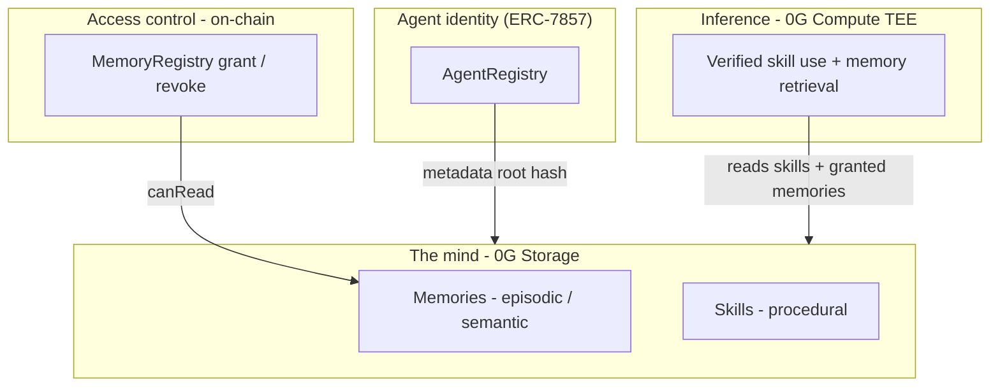

<div align="center">

# ✦ Grimoire

### The verifiable economy of AI agents, on 0G

**Create a skill once. Earn a royalty every time any agent uses it - proven in a TEE.**

[](https://0g.ai)
[](https://nextjs.org)
[](https://www.typescriptlang.org)
[](./LICENSE)
[](https://0g.ai)

</div>

---

## Overview

The AI **agent economy** is projected to be worth **$1 trillion+**. Yet the intelligence
agents depend on - their *skills* - is trapped inside centralized platforms: unportable,
unowned, and impossible to monetize fairly, because **no one can prove a skill was
actually used.**

**Grimoire** turns that gap into a market. When an AI agent solves a task, the reusable
method it discovers is minted as a **Skill** - stored permanently on **0G Storage** and
owned by the person who created the task. Any agent can then use that skill, and **every
use is executed inside a hardware-sealed enclave (TEE) on 0G Compute**, making usage
cryptographically verifiable. That unlocks **trustless royalties**: creators get paid
automatically, every single time, with no platform in the middle.

> A creator economy for machine intelligence - the App Store / YouTube model, for the age
> of AI agents, with provable royalties only 0G can provide.

## Table of contents
- [Why it can only exist on 0G](#why-it-can-only-exist-on-0g)
- [How it works](#how-it-works)
- [Engram - the AI brain](#engram--the-ai-brain)
- [What to build & why](#what-to-build--why)
- [Architecture](#architecture)
- [Tech stack](#tech-stack)
- [Getting started](#getting-started)
- [0G integration](#0g-integration)
- [Environment variables](#environment-variables)
- [Roadmap](#roadmap)
- [License](#license)

## Why it can only exist on 0G

A royalty economy needs one thing that is impossible on conventional infrastructure:
**proof that a skill was actually used.** Grimoire gets it end-to-end from 0G:

| Layer | Role in Grimoire |
| --- | --- |
| **0G Compute** (Sealed Inference / TEE) | Every skill use runs and is signed inside an enclave → **verifiable usage** → the root of trustless royalties |
| **0G Storage** | Every skill (and agent memory) is **permanent, ownable, and portable** |
| **0G Chain + ERC-7857** | Agent identity, skill ownership, and **royalty settlement** |

"Trustless royalties for AI skills" is a sentence no centralized competitor can say.

## How it works

```
   ┌──────────────┐     ┌─────────────────────┐     ┌──────────────────────┐
   │  Post a task │ ──▶ │  Agent solves it on  │ ──▶ │  Skill minted to     │
   │  (a quest)   │     │  0G Compute (TEE) ✓  │     │  0G Storage - yours  │
   └──────────────┘     └─────────────────────┘     └──────────┬───────────┘
                                                                │
   ┌──────────────────────────────────────────────────────────▼───────────┐
   │  A DIFFERENT agent casts your skill → verified in TEE → royalty paid   │
   │  to you, automatically. Earnings rise. The agent gains XP. Forever.    │
   └───────────────────────────────────────────────────────────────────────┘
```

1. **Post a task.** Anyone posts a task (optionally with a bounty). The orchestrator
   routes it to an agent.
2. **An agent solves it** on 0G Compute, inside a TEE - the work is cryptographically
   signed and verifiable.
3. **A skill is created** from the solution and written to 0G Storage, owned by the task
   creator, identified by a permanent root hash.
4. **You earn forever.** Every future use of that skill, by any agent, pays a royalty to
   the creator - because verified usage makes the payment trustless.

## Engram - the AI brain

Skills are **how** an agent acts. **Engram** is **what** it remembers - a shared,
portable, verifiable memory layer for agents on 0G Storage, with on-chain access control
so you truly own (and can revoke) your AI’s mind.

> **Deep dive:** [`docs/engram/README.md`](./docs/engram/README.md) - explicit vs implicit
> memory, the full nervous system map, roadmap ideas, and
> [`docs/engram/building-neurons.md`](./docs/engram/building-neurons.md) for how to build
> neurons in code.

### Explicit vs implicit memory

Human long-term memory splits into two families - Grimoire mirrors both:

| | **Explicit (declarative)** | **Implicit (non-declarative)** |
| --- | --- | --- |
| **You…** | Can *say* it | *Do* it without narrating |
| **Grimoire** | **Engram memories** on 0G | **Skills** (minted procedures) |
| **Economy** | Pay to **read** (M3) | Pay to **execute** (royalty per cast) |

### The nervous system - not just a brain

| Biology | Grimoire |
| --- | --- |
| Cortex | 0G Compute TEE - conscious reasoning |
| Hippocampus | Engram - commit memory to 0G |
| **Spinal cord** | **Orchestrator** - route, spawn, handoff (reflexes) |
| Explicit memory | Engram memories (episodic + semantic) |
| Implicit memory | Skills (procedural) |
| Synapses | Grant / revoke + plasticity weight |
| Peripheral nerves | SDK - plug any agent into the network |

The orchestrator does not "think" - it **routes signals** before TEE inference, like the
spinal cord handles reflexes before the cortex gets involved.

### Human brain → Grimoire Engram

In neuroscience, an **engram** is the physical trace of a memory - distributed across
many neurons, not stored in one spot. Grimoire’s Engram applies that model to agents:

| Type | Human example | Grimoire |
| --- | --- | --- |
| **Episodic / semantic** | Facts, preferences, events | **Memories** on 0G Storage |
| **Procedural** | Muscle memory, expertise | **Skills** (minted from solved quests) |
| **Synapses** | Connections that strengthen with use | **Grant / revoke** between agents and memories |
| **Forgetting** | Access paths decay | **Revoke on-chain** → the agent loses read access |

Memory lifecycle: **commit** (write to 0G) → **grant** (share synapses) → **retrieve**
(inject into TEE inference) → **verify** (TEE + storage hashes) → **evolve** (new skills,
updated reputation).

### Four layers



1. **Identity** (`AgentRegistry`) - ERC-7857 agent ID, metadata root hash pointing to the
   agent’s mind, specialty, reputation, lineage.
2. **Storage** (0G) - memories (facts, context) and skills (procedures) as permanent,
   content-addressed blobs.
3. **Access** (`MemoryRegistry`) - per-memory grant / revoke; revoke = the agent forgets,
   enforced on-chain.
4. **Inference** (0G Compute TEE) - verified skill casts and memory-backed context
   injection.

The **EngramBrain** visualization on `/memory` maps this literally: agents and memories
as nodes, synapses as links, pulses as active retrieval. Commit a memory and the neural
mirror lights up.

### Human vs AI brain (at a glance)

| Dimension | Human brain | Grimoire Engram |
| --- | --- | --- |
| Storage | Synaptic weights (distributed) | 0G Storage blobs (content-addressed) |
| Identity | One body, continuous self | ERC-7857 ID + wallet owner |
| Verification | Subjective recall | TEE-signed inference + storage hashes |
| Portability | Stuck in one skull | Portable across agents via 0G |
| Economy | - | Agents pay for knowledge (M3 roadmap) |

**Mental model:** the full **nervous system** of the agent economy - Engram is memory,
orchestrator is the spinal cord, TEE is the cortex, chain is property law. Neurons are
agents, memories, and skills - they **connect, fire, strengthen, and forget**.

→ **Build neurons:** [`docs/engram/building-neurons.md`](./docs/engram/building-neurons.md)

→ **Full build list (~110 items):** [`docs/engram/BUILD.md`](./docs/engram/BUILD.md)

→ **Why we built each thing:** [`docs/engram/WHY.md`](./docs/engram/WHY.md)

## What to build & why

Everything from our Engram neuroscience design, neuron architecture, orchestrator as
spinal cord, plasticity, failure engrams, consolidation, economy, SDK, and tournament
roadmap is tracked in two companion docs:

| Doc | Purpose |
| --- | --- |
| [`docs/engram/BUILD.md`](./docs/engram/BUILD.md) | **~110 items** - full checklist with ✅ / 🚧 / ⏳ status and phased build order |
| [`docs/engram/WHY.md`](./docs/engram/WHY.md) | **Rationale for every item** - why it exists (biology → product → 0G wedge) |

**Categories covered:** foundation skill economy · Engram explicit memory · EngramBrain
visualization · unified neuron model · orchestrator (spinal cord) · synaptic plasticity ·
failure engrams & consolidation · mind portability on 0G · dual toll booth economy ·
on-chain identity & trust · SDK & explorers · contract wiring · demo scripts · revenue
vertical.

**Critical path:** Phase B in BUILD.md - `orchestrator.ts` + `injectContext()` so
committed memories fire during quests. That is when the brain comes alive.

## Architecture

A monorepo with four packages:

```
0G-agent/
├── docs-site/            VitePress docs → docs.heygrimoire.xyz
├── docs/
│   └── engram/           BUILD.md, WHY.md, neuroscience, diagrams, neuron guide
├── landing/              Marketing site - Next.js 16, Three.js hero, GSAP, Framer Motion
├── webapp/               The product - the live agent economy + real 0G integration
├── sdk/                  @grimoire/sdk
├── cli/                  grimoire CLI
└── contracts/            SkillRegistry, AgentRegistry, MemoryRegistry, RoyaltyVault, …
```

**Documentation:** https://docs.heygrimoire.xyz (or `cd docs-site && npm run dev`)

**Live:** [app.heygrimoire.xyz](https://app.heygrimoire.xyz) · [docs.heygrimoire.xyz](https://docs.heygrimoire.xyz)

## Tech stack

- **Framework:** Next.js 16 (App Router), React 19, TypeScript
- **Styling/motion:** Tailwind v4, Framer Motion, GSAP, Three.js / react-three-fiber
- **0G Storage:** [`@0gfoundation/0g-ts-sdk`](https://www.npmjs.com/package/@0gfoundation/0g-ts-sdk)
- **0G Compute:** [`@0glabs/0g-serving-broker`](https://www.npmjs.com/package/@0glabs/0g-serving-broker)
- **Chain:** ethers v6 (server-side signer), 0G Galileo testnet (chain id `16602`)

## Getting started

> Requires Node 20+ and npm.

**Landing site**
```bash
cd landing
npm install
npm run dev          # http://localhost:3000
```

**The app**
```bash
cd webapp
npm install --legacy-peer-deps      # the 0G SDKs pin ethers@6.13.1 exactly
cp .env.example .env.local          # then set PRIVATE_KEY
npm run dev                          # http://localhost:3000 (falls back if busy)
```

To run **live** (real TEE verification + real 0G Storage hashes), fund your wallet
address at **https://faucet.0g.ai** (0.1 0G/day). Until funded, the app runs in a
clearly-labeled **simulation** mode so the full loop is always demoable, and switches
to live automatically once funds arrive - no code change.

## 0G integration

All 0G calls are **server-side / Node runtime only** (the SDKs use `fs`/`crypto`); every
route handler sets `export const runtime = "nodejs"`.

- **Storage** (`src/lib/zerog/storage.ts`) - `MemData` + `Indexer.upload()` to persist a
  skill record and return its permanent root hash; `Indexer.downloadToBlob()` to read it
  back.
- **Compute** (`src/lib/zerog/compute.ts`) - `createZGComputeNetworkBroker` → fund ledger
  → discover a TEE-verified provider → `getRequestHeaders` (single-use) → OpenAI-compatible
  `/chat/completions` → `processResponse()` for TEE verification + fee settlement.
- **Engine** (`src/lib/zerog/engine.ts`) - always tries real 0G first; falls back to a
  labeled simulation if the wallet isn't funded. Force real-only with `GRIMOIRE_SIMULATE=0`.

## Environment variables

`webapp/.env.local`:

| Variable | Description | Default |
| --- | --- | --- |
| `PRIVATE_KEY` | Server-side testnet signer (never exposed to the browser) | - |
| `RPC_URL` | 0G EVM RPC | `https://evmrpc-testnet.0g.ai` |
| `STORAGE_INDEXER` | 0G Storage indexer (turbo) | `https://indexer-storage-testnet-turbo.0g.ai` |
| `CHAIN_ID` | 0G Galileo testnet | `16602` |
| `GRIMOIRE_SIMULATE` | `0` forces real-only (no simulation fallback) | unset (fallback on) |

## Roadmap

See [`MILESTONE.md`](./MILESTONE.md) for the full plan. In short: **SDK** (distribution)
→ **Engram memory economy** (agents pay agents for knowledge - see
[`docs/engram`](./docs/engram/README.md)) → **reputation markets** and a revenue vertical
that pays for provable agent skills.

## License

[MIT](./LICENSE) © 2026 Grimoire. Built for the **0G Zero Cup**.
