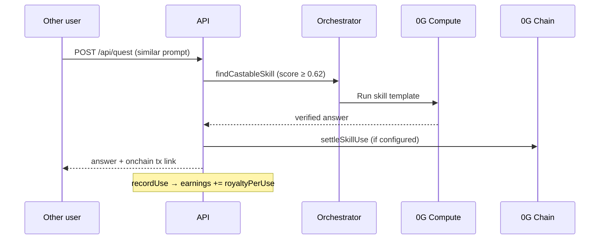

# Royalties

Royalties pay skill **creators** when someone else reuses their skill on a verified execution.


## Flow



## When royalties apply

| Condition | Required |
| --- | --- |
| Skill reuse | Orchestrator matches existing skill OR explicit `/api/skills/{id}/run` |
| Different wallet | `callerAddress` ≠ `skill.creatorAddress` |
| Verified execution | `result.verified === true` and not simulated |
| On-chain settlement | Server has contract + signer configured |

Self-reuse never pays royalty to yourself.

## Rates by rarity

Set at mint from `royaltyForRarity()`:

| Rarity | `royaltyPerUse` |
| --- | --- |
| common | 0.002 0G |
| rare | 0.005 0G |
| epic | 0.012 0G |
| legendary | 0.030 0G |

Listed on each skill object. Market listings trade ownership of the royalty stream.

## Where royalties appear

### API response

```json
{
  "onchain": {
    "txHash": "0x…",
    "url": "https://chainscan-galileo.0g.ai/tx/0x…"
  },
  "usedSkill": { "name": "…", "royaltyPerUse": 0.012 }
}
```

### State endpoint

```http
GET /api/state?address=0xCreatorWallet
```

Returns `royalties` array:

```json
{
  "id": "r_…",
  "skillId": "0x…",
  "skillName": "Neon Gaming Landing",
  "amount": 0.012,
  "to": "0xCreator…",
  "verified": true,
  "txHash": "0x…",
  "at": 1710000000000
}
```

### Wallet tasks

Post: `"how much have I earned in royalties?"` → direct answer with top skills.

### Console

Royalty feed on home and Library pages.

## Skill stats

Each skill tracks:

- `uses` - total orchestrator runs
- `earnings` - cumulative royalties (0G)
- `royaltyPerUse` - per-event rate

Updated via `db.recordUse()` on each verified reuse.

## On-chain contracts

When configured, `settleSkillUse()` sends native 0G to creator. `registerSkillOnChain()` registers new skills at mint.

See [Contracts](/contracts/).

## Maximizing royalties

1. Mint distinctive skills - longer, verified prompts → higher rarity
2. Build tasks mint reusable project templates
3. List on Market so others discover your royalty stream
4. Avoid duplicate prompts - similar skills won't mint twice

Related: [Skills](/concepts/skills), [Wallet](/concepts/wallet)
