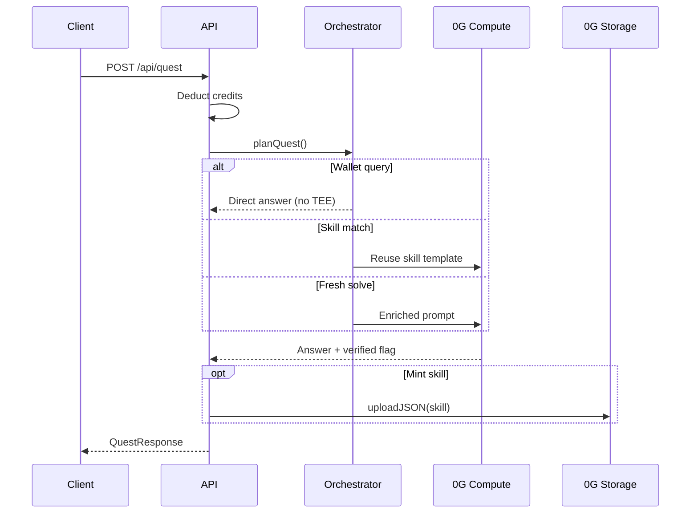

# Tasks & routing

A **task** is a single request to the Grimoire platform. Tasks are the unit of work for inference, skill minting, and royalties.

## Lifecycle

## Intent detection

The server classifies prompts automatically:

| Mode | Triggers (examples) |
| --- | --- |
| **build** | "build a landing page", "create a portfolio site", "design a SaaS homepage" |
| **code** | "write a hook", "implement a function", mentions `.ts`, `typescript`, `python` |
| **summarize** | "summarize", "bullet points", "key takeaways", attachments + short prompt |
| **ask** | Default for research, explanation, analysis |

Wallet queries (`balance`, `earnings`, `my skills`, `trade`) bypass TEE and return live ledger + chain data.

## Build clarification

Short vague build prompts (e.g. "build me a website" under ~55 chars without style keywords) receive **clarifying questions** instead of code files. Add style, audience, or sections to get a full build.

Keywords that skip clarification: `portfolio`, `gaming`, `saas`, `neon`, `dark`, `minimal`, `developer`, `dashboard`, etc.

## Orchestrator routing

Before inference, `planQuest()` decides:

| Reflex | Meaning |
| --- | --- |
| `category-match` | Agent matched by specialty (Research, Code, Writing, …) |
| `spawn` | New specialist agent created for the category |
| `skill-cast` | Existing skill similarity ≥ 0.62 - skill template reused |
| `manual` | Explicit `agentId` in request |
| `blocked` | Previously failed approach avoided |

### Skill matching

Similarity uses word overlap between prompt and `promptTemplate`, plus:

- Category bonus (+0.12 if skill category matches)
- Usage bonus (up to +0.15 from prior uses)

Threshold: **0.62** to reuse a skill.

### Memory injection

Up to **5 memories** scored by relevance to prompt, weighted by synapse strength. Failure memories get +0.35 boost; preferences +0.15; semantic +0.10.

## Credits

Credits are deducted **before** execution. Failed tasks (server error after deduction) are **refunded**.

Minimum prompt length: **4 characters** (unless attachments provide content).

## Artifacts

Build tasks may return a `project` artifact - multi-file Next.js tree. Code tasks return `code` artifacts. See [Task response](/api/quest-response).

## API

Primary endpoint: [POST /api/quest](/api/post-task)

SDK: [createTask](/sdk/create-task)
