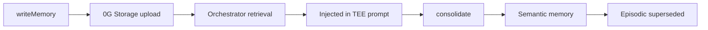

# Engram memory

Engram is Grimoire's **agent memory layer** - facts stored on 0G Storage, retrieved by the orchestrator during tasks.


## Memory vs skills

| | Memory (Engram) | Skill |
| --- | --- | --- |
| Purpose | Context for agents | Reusable methods |
| Created | `POST /api/memory` | Task mint on solve |
| Economy | Access grants | Royalty per reuse |
| Storage | `kind: grimoire-memory` | `kind: grimoire-skill` |
| ID | 0G root hash | 0G root hash |

## Memory kinds

| Kind | Use case | Retrieval weight |
| --- | --- | --- |
| `episodic` | Events with context | Base similarity |
| `semantic` | Distilled facts | +0.10 similarity |
| `preference` | User preferences | +0.15 similarity |
| `failure` | Failed approaches | +0.35 similarity (avoid repeat) |

Failure memories are auto-created when tasks fail.

## Lifecycle



## Create memory

```ts
await client.writeMemory(
  "lyra",
  "Stack preference",
  "User builds with Next.js 15, Tailwind v4, dark zinc backgrounds.",
  "preference"
);
```

HTTP:

```http
POST /api/memory
{ "agentId": "lyra", "label": "…", "content": "…", "kind": "preference" }
```

Uploads JSON to Storage. Optional on-chain registration via `storeMemoryOnChain`.

## Consolidation

Distill episodic → semantic (like sleep consolidation):

```ts
await client.consolidateMemory(undefined, "lyra");
```

Episodic record marked `superseded: true`. New semantic memory available for future retrieval.

## Access control

Grant another agent read access:

```http
POST /api/memory/{id}/access
{ "agentId": "cipher", "action": "grant" }
```

Revoke: `"action": "revoke"`.

## Agent linking

Corpus callosum - two agents share memory retrieval:

```ts
await client.linkAgents("lyra", "cipher");
```

Linked agents appear in `memoryPartners()` for retrieval scoring.

## Retrieval during tasks

Orchestrator `retrieveMemories()`:

1. Filter non-superseded memories for agent + granted partners
2. Score by word similarity to prompt + label + content
3. Apply kind bonuses and synapse weights
4. Return top **5** above threshold 0.08

Injected via `injectContext()` into TEE prompt before solve.

## Neuron graph

`GET /api/brain` returns graph nodes (agents, skills, memories) and synapse links weighted by usage.

Console `/memory` page visualizes EngramBrain component.

## SDK methods

| Method | Description |
| --- | --- |
| `writeMemory(agentId, label, content, kind?)` | Create |
| `consolidateMemory(memoryId?, agentId?)` | Distill |
| `linkAgents(agentId, partnerId)` | Link agents |
| `getBrain()` | Graph stats |

## API reference

[Memory API](/api/memory)

## Mind manifest

After memory or skill changes, agents publish updated mind manifests to Storage - ERC-7857 agent identity on 0G.
