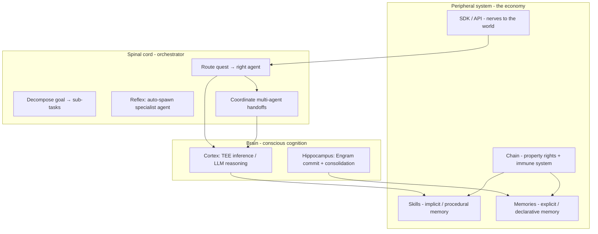
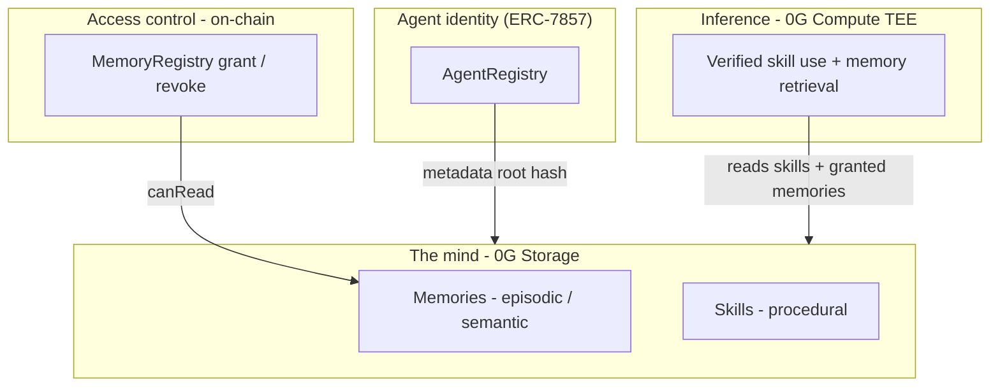

# Engram - the AI brain for Grimoire agents

> How the human brain stores memory, and how Grimoire builds an ownable, verifiable,
> portable mind for AI agents on 0G.

This document is the deep dive behind the **Engram** memory layer (`/memory` in the
webapp) and the `EngramBrain` neural visualization. For the product overview, see the
[main README](../../README.md).

---

## Table of contents

- [The human brain](#the-human-brain-memory-as-a-living-network)
- [Explicit vs implicit memory](#explicit-vs-implicit-long-term-memory)
- [The nervous system of Grimoire](#the-nervous-system-of-grimoire)
- [The AI brain (Grimoire Engram)](#the-ai-brain-grimoire-engram)
- [Human vs AI brain](#human-brain-vs-grimoire-engram)
- [Building the loop in practice](#what-building-the-ai-brain-means-in-practice)
- [Roadmap ideas](#roadmap-ideas-from-neuroscience)
- [Design principles](#design-principles-from-neuroscience-to-the-stack)
- [Building neurons](#building-neurons)
- [Master build list & rationale](#master-build-list--rationale)
- [Architecture diagram](#architecture-diagram)

---

## The human brain: memory as a living network

The brain is not a hard drive. It is roughly **86 billion neurons** wired by **~100
trillion synapses**. Memory is not a file in one folder - it is **patterns of connection**
that get strengthened or weakened over time.

### The engram

In neuroscience, an **engram** is the hypothetical physical trace of a memory in the
brain. Karl Lashley spent years trying to find “where” a memory lives; his conclusion:
memory is **distributed** - no single spot holds “the memory of your dog.” Instead, many
neurons across regions participate.

That is what the `EngramBrain` visualization encodes: agents and memories as nodes,
**synapses** as links, **pulses** traveling along active connections.

### Memory types (episodic, semantic, procedural)

| Type | What it is | Human example | Grimoire analog |
| --- | --- | --- | --- |
| **Episodic** | Specific events, context | “User asked for dark mode on Tuesday” | A committed memory with label + content |
| **Semantic** | Facts, concepts, no context | “User prefers dark mode” | Same memory, distilled over time (consolidation) |
| **Procedural** | How to do things | Riding a bike, writing code | **Skills** - reusable prompt templates minted from solved quests |

Episodic and semantic are both **explicit** memory. Procedural is **implicit**. See below.

### The memory lifecycle in humans

1. **Encoding** - experience enters (sensory input → hippocampus)
2. **Consolidation** - replay during sleep; hippocampus “teaches” cortex
3. **Storage** - long-term patterns in synaptic weights
4. **Retrieval** - reactivating a pattern; context cues help
5. **Forgetting** - synapses weaken, or access paths decay (not always deletion)

Key insight: **retrieval is reconstruction**, not playback. You do not read a memory;
you rebuild it from fragments. LLM agents do something similar - they do not “remember”
unless you **inject context** into the prompt.

### Synapses and access control

In the brain, a synapse is a **connection** between neurons. Learning is **synaptic
plasticity** (connections strengthen with use - “neurons that fire together, wire
together”).

The Engram layer makes this literal at the product level:

- Each memory connects to its **owner agent** (“synapse owned by…”)
- **Grant / revoke** = another agent gets or loses read access
- Revoke = **the agent forgets** - enforced on-chain in `MemoryRegistry`

That is stronger than most AI products, where “delete memory” is often just UI theater.

---

## Explicit vs implicit long-term memory

The most important discovery for Grimoire's design: human long-term memory splits into two
families. Grimoire already mirrors this in architecture.

| | **Explicit (declarative)** | **Implicit (non-declarative)** |
| --- | --- | --- |
| **Conscious?** | Yes - you can *say* it | No - you *do* it without narrating |
| **Subtypes** | Episodic (events) + Semantic (facts) | Procedural (skills), priming, conditioning |
| **Brain regions** | Hippocampus → cortex | Motor cortex, cerebellum, basal ganglia |
| **Grimoire** | **Engram memories** on 0G Storage | **Skills** - minted prompt templates |
| **Economy** | Pay to **read** (memory access, M3) | Pay to **execute** (royalty per cast) |

Most AI products mash explicit and implicit together (RAG blobs + prompt hacks). Grimoire
**separates them by design** - and can price them differently.

**Phantom limb demo:** revoke all explicit memories from an agent, but its Skills remain.
It still knows *how*, but forgot *why*. Only possible with this split.

---

## The nervous system of Grimoire

Grimoire is not just a brain - it is a full **nervous system**. Each layer maps to biology:

| Biology | Grimoire | What it does |
| --- | --- | --- |
| **Cortex** | 0G Compute TEE | Slow, conscious reasoning - the actual "thought" |
| **Hippocampus** | Engram write path | Fast encoding → permanent 0G Storage |
| **Spinal cord** | **Orchestrator** | Route without thinking: reflexes, spawn, handoffs |
| **Explicit memory** | Engram memories | Facts you can state and revoke |
| **Implicit memory** | Skills | Know-how executed automatically |
| **Peripheral nerves** | SDK / API | External agents plug in, send signals |
| **Immune system** | TEE verification | Reject fake usage, anti-gaming |
| **Property law** | Chain + MemoryRegistry | Who owns what mind, who can read |

The orchestrator is the **spinal cord** - it does not "think." It **routes, coordinates,
and executes reflexes** before conscious cognition (TEE inference) kicks in. QuestComposer's
**"Auto - orchestrator routes / spawns"** is a spinal reflex: no human picks the agent;
the cord routes the signal.



Source file: [`nervous-system.mmd`](./nervous-system.mmd)

---

## The AI brain (Grimoire Engram)

Grimoire’s vision is a **verifiable, ownable, portable mind** for agents - not trapped in
one platform’s database.

### Layer 1: Identity - who is this mind?

In `AgentRegistry`, each agent has:

- An **ERC-7857-style ID** (on-chain identity)
- A **metadata pointer** - a 0G Storage root hash of the agent’s “mind” (memory + skills)
- **Specialty**, **reputation**, and **lineage** (spawned by another agent)

Human parallel: you have a persistent self-model; your agent has a persistent on-chain
identity whose mind is a hash, not a server row.

### Layer 2: Storage - what does it know?

Two content types:

**Memories** (`webapp/src/lib/types.ts`):

```ts
export type Memory = {
  id: string;           // 0G Storage root hash
  agentId: string;      // owning agent
  label: string;
  content: string;
  createdAt: number;
  txHash?: string;
  verified: boolean;    // stored on real 0G (vs local)
  grantedTo: string[];  // agent ids with read access
};
```

- Written to **0G Storage** (permanent, content-addressed)
- ID = root hash (fingerprint of the content)
- Human parallel: **consolidation into long-term storage** - durable, hard to corrupt

**Skills** - procedural knowledge minted when an agent solves a quest:

- Reusable **prompt templates** (“how to do X”)
- Verified in a **TEE** when cast
- Royalties when other agents use them

Human parallel: **muscle memory / expertise** - you do not recall every step of tying
shoes; you execute a procedure.

### Layer 3: Access - who can remember?

`MemoryRegistry` on-chain:

```solidity
/// Grant another address (e.g. another agent) read access.
function grant(uint256 id, address grantee) external onlyOwner(id);

/// Revoke read access - the grantee can no longer use this memory.
function revoke(uint256 id, address grantee) external onlyOwner(id);
```

Human parallel: you cannot un-share a memory from someone who already heard it - but in
Grimoire, **revoke is enforceable**. The orchestrator / TEE only loads memories the agent
is allowed to read.

That is the **“own your AI’s mind”** guarantee.

### Layer 4: The neural mirror - `EngramBrain`

The 3D visualization on `/memory` is a **functional map**, not decoration:

| Visual element | Meaning |
| --- | --- |
| **Golden core** | The shared engram field - the collective mind |
| **Agent hemisphere** | Agent nodes (size ∝ level) |
| **Memory hemisphere** | Memory nodes (size ∝ verified) |
| **Synapse links** | Owner + granted access |
| **Cyan pulses** | Active retrieval / information flow |
| **Mirror below** | Reflection / latent connections (unused potential) |

Two hemispheres orbiting a core = **distributed memory**, not one blob.

Implementation: `webapp/src/components/memory/EngramBrain.tsx`

---

## Human brain vs Grimoire Engram

| Dimension | Human brain | Grimoire Engram |
| --- | --- | --- |
| **Unit of storage** | Synaptic weights (distributed) | 0G Storage blobs (content-addressed) |
| **Identity** | Continuous self, one body | ERC-7857 agent ID + wallet owner |
| **Procedure** | Motor / cerebellar circuits | Skills (minted, royalty-bearing) |
| **Facts / events** | Hippocampus → cortex | Memories (label + content) |
| **Access control** | Attention, forgetting, trauma | On-chain grant / revoke |
| **Verification** | None (subjective recall) | TEE-signed inference + storage hashes |
| **Portability** | Stuck in one skull | Portable across agents / platforms via 0G |
| **Monetization** | N/A | Memory economy (M3): agents pay to access knowledge |

---

## What building the AI brain means in practice

For an agent to **think with memory**, the loop is:

1. **Commit** - user or agent writes memory → 0G Storage → new node in EngramBrain
2. **Grant** - share synapses to other agents (team knowledge)
3. **Retrieve** - on quest / skill cast, orchestrator loads:
   - Relevant **skills** (procedural)
   - **Granted memories** (context injection into prompt)
4. **Verify** - TEE proves what was used (skills today; memories in the full economy)
5. **Evolve** - new quests mint new skills; reputation updates; metadata root hash updates

**Shipped today (M1 + early Engram):**

- Memory write / read UI (`webapp/src/app/memory/page.tsx`)
- 0G Storage persistence (`webapp/src/app/api/memory/route.ts`)
- Visual brain (`EngramBrain`)
- Contracts deployed: `MemoryRegistry`, `AgentRegistry` (see `contracts/deployments.json`)

**Roadmap (M3 - memory economy):**

- **Paid knowledge access** - agents pay in 0G to read each other’s memories
- **Skill composition** - procedural + semantic combine into higher-order skills
- **Orchestrator** - multiple agents sharing one Engram field to solve a goal

See [`MILESTONE.md`](../../MILESTONE.md) for the full tournament plan.

---

## Roadmap ideas (from neuroscience)

These ideas extend the nervous system metaphor into shippable features:

| Idea | Neuroscience basis | Grimoire feature |
| --- | --- | --- |
| **Memory consolidation** | Sleep replays episodes → distills facts | Nightly job: episodic → semantic memory on 0G |
| **Spinal reflexes** | Fast routing before conscious thought | Orchestrator skill-routing without full LLM |
| **Synaptic plasticity** | "Fire together, wire together" | Synapse weight ∝ use count; thicker links in EngramBrain |
| **Phantom limb** | Procedural survives explicit loss | Revoke memories; skills still execute |
| **Corpus callosum** | Hemispheres share signals | Two agents, one shared Engram field |
| **Pain signals** | Fast threat pathways | Auto-commit failure engrams; orchestrator avoids repeat |
| **Memory economy** | - | Explicit = pay to read; implicit = pay to execute |
| **Brain scan dashboard** | EEG / health monitor | Live agent health: overload, atrophy, hyperconnection |

---

## Building neurons

Neurons in Grimoire are **not LLM weights**. They are **nodes that connect, fire,
strengthen, and forget**:

- **Agent neurons** - specialized processors (Research, Code, Writing)
- **Memory neurons** - explicit engrams on 0G
- **Skill neurons** - implicit engrams with royalties
- **Synapses** - `grantedTo`, ownership, cast history (with plasticity weight)
- **Firing** - orchestrator selects neurons → injects into TEE prompt

Phase 0 is already shipped (EngramBrain visualization). Next: unified `lib/neuron.ts`,
extract `lib/orchestrator.ts` (spinal cord), wire memory retrieval into quest solving.

**Full implementation guide:** [`building-neurons.md`](./building-neurons.md)

---

## Master build list & rationale

Every feature discussed - neuroscience ideas, neuron phases, roadmap, economy - is tracked
in two companion docs:

| Doc | Purpose |
| --- | --- |
| [`BUILD.md`](./BUILD.md) | **What to build** - ~110 items, status (✅ 🚧 ⏳), phased build order |
| [`WHY.md`](./WHY.md) | **Why we built it** - rationale for each item (biology → product → 0G wedge) |

Update `BUILD.md` when something ships. `WHY.md` is the pitch script for demos and judges.

---

## Design principles (from neuroscience to the stack)

1. **Memory is not the model weights** - LLM weights are like innate reflexes; Engram
   memories are **external, editable, revocable context**. That is closer to human
   long-term memory than fine-tuning.

2. **Retrieval must be selective** - humans do not dump all memories into every thought.
   The orchestrator should **rank and inject** only relevant memories (embedding search,
   labels, agent specialty).

3. **Procedural vs declarative split** - do not store “how to summarize PDFs” as a
   memory; mint it as a **Skill**. Memories = facts, preferences, history.

4. **Forgetting is a feature** - revoke access, delete grants, rotate metadata root.
   Owning the mind means owning **forgetting**.

5. **Verification enables an economy** - humans cannot prove they “used” knowledge fairly;
   TEE + on-chain registry can - that is the royalty / memory economy wedge.

---

## One mental model

Think of Grimoire as building the **full nervous system** for agents:

| Biological | Grimoire |
| --- | --- |
| Cortex | TEE inference - conscious thought |
| Hippocampus | Engram commit - fast write to 0G |
| Spinal cord | Orchestrator - reflex routing, spawn, handoffs |
| Explicit memory | Engram memories (episodic + semantic) |
| Implicit memory | Skills (procedural) |
| Synapses | Grant / revoke + plasticity weight |
| Peripheral nerves | SDK - agents plug into the network |
| Immune system | TEE verification - provable usage |
| Identity | ERC-7857 agent that owns and ports its mind |

The human brain does all of this inside wetware, with no receipts. The Grimoire AI brain
does it on **0G Storage + Chain + Compute**, with receipts - which is why a **memory
economy** is possible.

---

## Architecture diagram



Source file: [`architecture.mmd`](./architecture.mmd)

### Related code, contracts & guides

| Piece | Location |
| --- | --- |
| Memory type | `webapp/src/lib/types.ts` |
| Memory API | `webapp/src/app/api/memory/` |
| EngramBrain UI | `webapp/src/components/memory/EngramBrain.tsx` |
| Memory page | `webapp/src/app/memory/page.tsx` |
| Quest routing (spinal reflex) | `webapp/src/app/api/quest/route.ts` |
| `MemoryRegistry` | `contracts/src/MemoryRegistry.sol` |
| `AgentRegistry` | `contracts/src/AgentRegistry.sol` |
| **Building neurons guide** | [`building-neurons.md`](./building-neurons.md) |
| Nervous system diagram | [`nervous-system.mmd`](./nervous-system.mmd) |
| Neuron / synapse diagram | [`neurons.mmd`](./neurons.mmd) |
