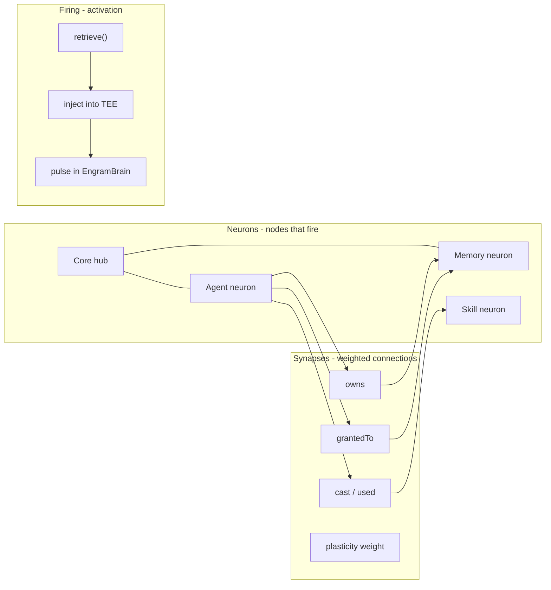

# Building neurons - the Grimoire implementation guide

> How to turn agents, memories, and skills into a real neural network - nodes that
> connect, fire, strengthen, and forget.

Read first: [`README.md`](./README.md) (the neuroscience) · [`nervous-system.mmd`](./nervous-system.mmd) (full body map)

---

## What is a neuron in Grimoire?

In biology, a **neuron** is a cell that receives signals, integrates them, and fires when
a threshold is crossed. It does not store one memory - it participates in patterns.

In Grimoire, a **neuron is not an LLM weight**. We do not train new weights. Instead:

| Neuron type | Already exists as | Role |
| --- | --- | --- |
| **Agent neuron** | `Agent` | Specialized processor - Research, Code, Writing |
| **Memory neuron** | `Memory` | Explicit (declarative) engram - facts, events, preferences |
| **Skill neuron** | `Skill` | Implicit (procedural) engram - how to do something |
| **Core hub** | EngramBrain golden core | Shared field all agents plug into |

A neuron **fires** when the orchestrator selects it for a quest: its content gets injected
into the TEE prompt, or its skill template gets executed.



Source: [`neurons.mmd`](./neurons.mmd)

---

## What you already have (Phase 0)

These are neurons in everything but name:

| Piece | File | Neuron behavior |
| --- | --- | --- |
| Agent nodes | `webapp/src/lib/types.ts` → `Agent` | Sized by level in EngramBrain |
| Memory nodes | `Memory` | Explicit engrams on 0G Storage |
| Skill nodes | `Skill` | Implicit engrams, royalty on cast |
| Synapses | `Memory.grantedTo`, owner links | Visual links in EngramBrain |
| Pulses | `EngramBrain.tsx` | Cyan dots along active synapses |
| Spinal reflex | `webapp/src/app/api/quest/route.ts` | Auto-route / spawn agent by category |

The visualization already builds a graph in `buildBrainGraph()` - that **is** the neuron
layout engine.

---

## Phase 1 - Name and unify the neuron model

Add explicit types so the codebase speaks the same language as the docs.

**`webapp/src/lib/neuron.ts`** (new file):

```ts
export type NeuronKind = "agent" | "memory" | "skill" | "core";

export type Neuron = {
  id: string;
  kind: NeuronKind;
  label: string;
  specialty?: string;   // agents
  verified?: boolean;     // memories / skills
  level?: number;         // agents - affects node size
};

export type Synapse = {
  from: string;           // neuron id
  to: string;
  kind: "owns" | "granted" | "cast" | "spawned";
  weight: number;         // plasticity - starts at 1.0
  lastFired?: number;     // timestamp
};
```

**`buildNeuronGraph(db)`** - one function that reads agents + memories + skills from the
store and returns `{ neurons, synapses }`. Refactor `EngramBrain.buildBrainGraph()` to
consume this instead of duplicating logic.

Why: one source of truth for the brain map, usable by the orchestrator, the UI, and the
SDK.

---

## Phase 2 - Build the spinal cord (orchestrator)

Today routing lives inline in `quest/route.ts` (lines 45-61). Extract it.

**`webapp/src/lib/orchestrator.ts`** (new file):

```ts
export type RoutePlan = {
  agentId: string;
  spawnedAgent?: Agent;
  memories: Memory[];      // explicit neurons to fire
  skills: Skill[];         // implicit neurons to fire
  reflex: "category-match" | "spawn" | "skill-cast" | "manual";
};

export function planQuest(prompt: string, agentId: string): RoutePlan {
  // 1. REFLEX - spinal cord (fast, no LLM)
  //    - categorize(prompt) → match agent specialty
  //    - if no agent → spawn
  //    - if matching skill exists → prefer cast over re-solve

  // 2. RETRIEVE - hippocampus (select explicit memories)
  //    - memories where grantedTo includes agentId
  //    - rank by label/content similarity to prompt (keyword or embedding)

  // 3. PROCEDURE - cerebellum (select implicit skills)
  //    - skills in same category, sorted by uses / reputation

  // return RoutePlan
}
```

Wire `quest/route.ts` to call `planQuest()` before `solve()`. Pass selected memories
into the prompt:

```ts
const plan = planQuest(prompt, requestedAgent);
const enrichedPrompt = injectContext(prompt, plan.memories, plan.skills);
const result = await solve(enrichedPrompt);
```

**`injectContext()`** - the actual “firing”:

```ts
function injectContext(prompt: string, memories: Memory[], skills: Skill[]): string {
  const memBlock = memories.map(m => `[Memory: ${m.label}]\n${m.content}`).join("\n\n");
  const skillBlock = skills.map(s => `[Skill: ${s.name}]\n${s.promptTemplate}`).join("\n\n");
  return `${memBlock}\n\n${skillBlock}\n\nTask: ${prompt}`;
}
```

This is how neurons **fire** - not by changing weights, but by entering the context window.

---

## Phase 3 - Synaptic plasticity (Hebbian learning)

Biology: *neurons that fire together, wire together.*

Grimoire: every time a memory or skill is used in a quest, **increment synapse weight**.

**Store synapse weights** in `.data/grimoire.json`:

```ts
type DB = {
  // ...existing...
  synapses: Synapse[];
};
```

**On quest complete:**

```ts
for (const mem of plan.memories) {
  db.strengthenSynapse(agentId, mem.id, "granted");
}
for (const skill of plan.skills) {
  db.strengthenSynapse(agentId, skill.id, "cast");
}
```

**In EngramBrain:** line thickness / pulse speed ∝ `synapse.weight`. Frequently used
paths glow brighter. Unused synapses fade.

**On-chain (later):** emit `SynapseFired(agentId, memoryId, weight)` events for
reputation and memory-economy pricing.

---

## Phase 4 - New neuron subtypes (roadmap features)

Each roadmap idea maps to a neuron behavior:

| Feature | Neuron behavior | Build step |
| --- | --- | --- |
| **Failure engrams** | Auto-commit memory neuron on quest failure | `POST /api/memory` from quest catch block |
| **Consolidation** | Episodic memory → new semantic memory neuron | Nightly job: LLM distills raw memories |
| **Phantom limb** | Revoke all explicit memories; skills still fire | Orchestrator skips revoked; skills always load |
| **Corpus callosum** | Two agents share `grantedTo` on same memories | UI: “link agents” button |
| **Pain signals** | Failure memories ranked higher in retrieve() | Boost weight on `kind: "failure"` memories |

---

## Phase 5 - Neuron on 0G (canonical mind blob)

Each agent’s **metadata root hash** (`AgentRegistry.metadata`) should point to a mind
manifest:

```json
{
  "kind": "grimoire-mind",
  "agentId": "arden",
  "neurons": {
    "memories": ["0xabc…", "0xdef…"],
    "skills": ["0x123…"]
  },
  "synapses": [
    { "from": "arden", "to": "0xabc…", "kind": "owns", "weight": 2.4 }
  ],
  "updatedAt": 1710000000
}
```

Upload to 0G Storage on every mind change. Update `AgentRegistry.updateMetadata()`.
Now the brain is **portable** - import an agent’s mind on any Grimoire node.

---

## Build order (recommended)

```
Phase 0  ✅  Agents, memories, skills, EngramBrain visualization
Phase 1  →   lib/neuron.ts + unified buildNeuronGraph()
Phase 2  →   lib/orchestrator.ts + injectContext() in quest route
Phase 3  →   Synapse weights in store + visual plasticity in EngramBrain
Phase 4  →   Failure engrams + consolidation job
Phase 5  →   Mind manifest on 0G + on-chain metadata updates
```

**Start with Phase 2** - it makes agents actually *use* their memories when solving quests.
That is the moment the brain comes alive.

---

## Quick test: is it working?

After Phase 2, this should work end-to-end:

1. Commit memory: *“User prefers bullet-point answers”* for agent Arden
2. Post quest to Arden: *“Explain quantum computing”*
3. Orchestrator fires the memory neuron → injects into prompt
4. TEE response uses bullet points
5. EngramBrain shows a pulse along the Arden → memory synapse

That demo proves explicit memory firing - something no generic chatbot can show on-chain.

---

## Related files

| What | Where |
| --- | --- |
| Neuron visualization | `webapp/src/components/memory/EngramBrain.tsx` |
| Quest routing (today) | `webapp/src/app/api/quest/route.ts` |
| Domain types | `webapp/src/lib/types.ts` |
| Economy store | `webapp/src/lib/store.ts` |
| Category reflex | `webapp/src/lib/skillMint.ts` → `categorize()` |
| TEE inference | `webapp/src/lib/zerog/engine.ts` |
